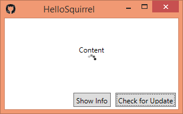

# hello.squirrel

[Squirrel.Windows](https://github.com/Squirrel/Squirrel.Windows) starter sample. It's a minimal WPF application showing how to update an existing application.

As extra candy i automated "releasifying" updates with msbuild. You can build updates by adjusting the version number in `solution.targets` and typing

    build /t:Deploy /p:DropLocation=c:\temp\Releases

You will then find release files like

  HelloSquirrel-0.1.6.0-full.nupkg
  HelloSquirrel-0.1.7.0-delta.nupkg
  HelloSquirrel-0.1.7.0-full.nupkg
  RELEASES
  Setup.exe
 
`Setup.exe` always includes the latest full version. The app looks for updates at `http://localhost:8080/Releases`. For testing purposes i just started [node http-server](https://www.npmjs.com/package/http-server) from `c:\temp`.